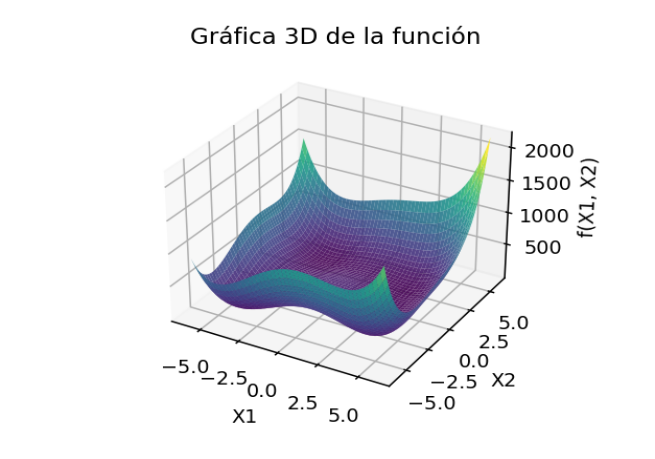

```{r setup, include=FALSE}
knitr::opts_chunk$set(echo = F,
                      eval = T, 
                      message = F,
                      warning = F)
```

\newpage

# Breve introducción 

Se planteo un ejercicio en clase donde se pedía encontrar el valor de $x$  que lograra encontrar el mínimo global de la función $f(x_1,x_2) = (x^2_1 + x_2-11) + (x_1 + x^2_2-7)$ haciendo uso de el método de busqueda de las direcciones conjugadas de Powel.

A continuación se muestra el pseudocodigo para implementar dicho método:

## Método de busqueda de direcciones conjugadas de Powell

Algoritmo

Paso 1: Elegir un punto de inicio $x^{(0)}$,una tolerancia $\epsilon$ y un conjunto de $N$ direcciones linealmente independientes; posiblemente $s^{(i)} = e^{(i)}$ para $i = 1, 2, 3, \ldots, N.$

Paso 2: Minimizar a lo largo de las  $N + 1$ direcciones, usando el mínimo previo para iniciar la siguiente búsqueda y haciendo que  $s^{(N)}$ sea la primera y la última dirección explorada.

Paso 3: Formar una nueva dirección conjugada  $d$ usando la propiedad extendida del subespacio paralelo.

Paso 4: IF $\|d\| \leq \epsilon$ o las direcciones de búsqueda no son linealmente independientes THEN Terminar.
ELSE hacer $s^{(1)} = s^{(2)}, s^{(2)} = s^{(3)}, \ldots, \, s^{(N-1)} = s^{(N)}$  Hacer $s^{(N)} = \frac{d}{\|d\|}$. GOTO Paso 2.


\newpage

# Experimentación con los resultados.

Primero, debido a que la función se puede graficar en un espacio de 3 dimensiones, se recurrió a esto para tener un referente visual del comportamiento de la misma:

```{python,eval = F}
# Cargar librerias
import numpy as np
import matplotlib.pyplot as plt
# Definir la función
def f(x, y):
    return (x**2 + y - 11)**2 + (x + y**2 - 7)**2
# Crear el grid
x = np.linspace(-6, 6, 500)
y = np.linspace(-6, 6, 500)
X, Y = np.meshgrid(x, y)
Z = f(X, Y)
# Graficar la superficie
fig = plt.figure(figsize=(10, 7))
ax = fig.add_subplot(111, projection='3d')
ax.plot_surface(X, Y, Z, cmap='viridis', alpha=0.9)
# Etiquetas
ax.set_title("Gráfica 3D de la función")
ax.set_xlabel('X1')
ax.set_ylabel('X2')
ax.set_zlabel('f(X1, X2)')
plt.show()
```




La función ya no es tan fácil de visualizar o seguir, debido al aumento de una dimensión extra. Dicha función se comporta como una sabana arrugada, la cual parece tener un mínimo muy en el centro de la función con posibles mínimos locales a las orillas.

\newpage

# Experimentación 

## Resolución de clase

Durante la clase se abordo la forma de iniciaizar el método con los siguientes parámetros:

$$
\begin{matrix}
x_0 = (0,4) & f(x_0) = 130  & \varepsilon = 0.001
\end{matrix}
$$

adicionalmente se plantearon los limites $a = -1, b = 10$ para inicializar el método de eliminación de regiones dentro del método principal

Una vez inicializado el algoritmo con dichos valores de $x_0$, $\varepsilon$, $a$ y $b$  se hizo la prueba de correr el algoritmo.

A continuación se muestran los resultados de las evaluaciones que hizo el algoritmo:

```{r}
rm(list=ls())
# Busqueda de direcciones conjugadas de Powell
# Librería para hacer las tablas bonitas
library(flextable)
# Llamo el código
source("Tarea 11. Conjugadas de Powell MAIN.R")
# Declaro la función que se desea minimizar
#### Evaluación para el ejercicio de clase ####
# fx = función multivariable
# X = punto inicial
# tol = tolerancia
# a = Limite inferior de busqueda
# b = Limite superior de busqueda
# Declaro la función que se desea minimizar
fx = function(X){(X[1]^2+X[2]-11)^2 + (X[1] + X[2]^2-7)^2}

#### Evaluación para el ejercicio de clase ####
x = c(0,4)
tol = 0.001
a = -1
b = 10

# Resultado de la corrida de clase forzandolo un poco
res1 = round(powell(fx,x,tol,a,b),5)
# Reporta bonito los resultados
autofit(theme_box(flextable(res1)))
```

Para esta evaluación de clase, con los parámetros iniciales dados, el método logra encontrar un punto que aproxima bastante bien uno de los mínimos de la función. Dicho punto es $[3.00047,2.00049]$ el cual satisface el criterio de tolerancia en apenas 7 iteraciones.

\newpage

## Propuesta con interalo de busqueda [-10,10]

Debido a la naturaleza tridimensional de la función, no es tan facil visualizar si es que dicha función es unimodal o multimodal.
Se sospecha que la función tiene más de un minimo, por lo que se decide probar que sucede al ampliar el intervalo de busqueda del método de acotamiento para probar sí es que encuentra otro punto que se pueda considerar un minimo.

Se mantienen todos los parametros iguales a excepción del intervalo de busqueda, el cual cambia por $a = -10$ y $b = 10$

A continuación se pone a prueba el algoritmo con dichos cambios:

```{r}
#### Evaluación con cambio de limites ####
x = c(0,4)
tol = 0.001
a = -10
b = 10
# Resultado de la corrida de clase forzandolo un poco
res2 = round(powell(fx,x,tol,a,b),5)
# Reporta bonito los resultados
autofit(theme_box(flextable(res2)))


```

El algoritmo logra encontrar otro mínimo de la función en apenas 2 iteraciones. Dicho punto que también minimiza a la función es $[-2.80513,3.13131]$.

\newpage

# Conclusiones

Tras la ejecución del algoritmo con los parámetros de clase y al aplicare una pequeña variación, resulta de interés el hecho de que el método aproxima bastante bien los mínimos de la función multivariable, pero es aun más llamativo el hecho de que la función puede tener más de un mínimo y que la función es capaz de encontrarlos, aunque esto lleva consigo la dificultad agregada de no poder saber con tanta facilidad si el mínimo que ya encuentra, es el mejor, se debe hacer un fino proceso se prueba con diferentes patrones para poder garantizar que el mínimo, es en efecto el mínimo que se esta buscando dadas las características que se desean satisfacer del problema.


\newpage

# Anexo 1: Codigo principal del método de busqueda de Powell

```{r}
# Incluir el código de bisección
cat(readLines("Tarea 11. Conjugadas de Powell MAIN.R"), sep = "\n")
```

\newpage

# Anexo 2: Código para hacer las evaluaciones del método.

```{r}
# Incluir el código de bisección
cat(readLines("Tarea 11. Conjugadas de Powell EVAL.R"), sep = "\n")
```

