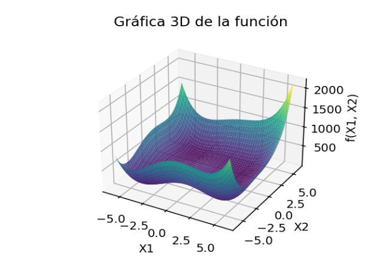

```{r setup, include=FALSE}
knitr::opts_chunk$set(echo = F,
                      eval = T, 
                      message = F,
                      warning = F)
```

\newpage

# Breve introducción 

Se planteo un ejercicio en clase donde se pedía encontrar el valor de $x$  que lograra encontrar el mínimo global de la función $f(x_1,x_2) = (x^2_1 + x_2-11) + (x_1 + x^2_2-7)$ haciendo uso de el método de busqued del descenso empinado.

A continuación se muestra el pseudocodigo para implementar dicho método:

## Método del descenso empinado.

Algoritmo

Paso 1: Elegir un punto inicial $X^{(0)}$ y dos parámetros de terminación $\varepsilon_1$ y $\varepsilon_2$. Hacer $k = 0$

Paso 2: Calcular $\nabla f(X^{(k)})$

Paso 3: **IF** $\|\nabla f(X^{(k)})\| \leq \varepsilon_1$ **THEN** Terminar **ELSE** ir al Paso 4.

Paso 4: Efectuar una búsqueda unidireccional para encontrar $\lambda^{(k)}$ y calcular: $X^{(k+1)} = X^{(k)} - \lambda^{(k)} \nabla f(X^{(k)})$ tal que $f(X^{(k+1)})$ sea mínima. Para efectuar la búsqueda unidireccional puede usarse la tolerancia $\varepsilon_2$ directamente en el método de minimización adoptado.
Alternativamente, puede checarse si $\|\nabla f(X^{(k+1)}) \cdot \nabla f(X^{(k)})\| \leq \varepsilon_2$.  

Paso 5: ¿Es $\left| \frac{f(X^{(k+1)}) - f(X^{(k)})}{f(X^{(k)})} \right| \leq \varepsilon_1?$ Si es así, Terminar. **ELSE** $k = k + 1$. Ir al Paso 2.

\newpage

# Experimentación con los resultados.

Primero, debido a que la función se puede graficar en un espacio de 3 dimensiones, se recurrió a esto para tener un referente visual del comportamiento de la misma:

```{python,eval = F}
# Cargar librerias
import numpy as np
import matplotlib.pyplot as plt
# Definir la función
def f(x, y):
    return (x**2 + y - 11)**2 + (x + y**2 - 7)**2
# Crear el grid
x = np.linspace(-6, 6, 500)
y = np.linspace(-6, 6, 500)
X, Y = np.meshgrid(x, y)
Z = f(X, Y)
# Graficar la superficie
fig = plt.figure(figsize=(10, 7))
ax = fig.add_subplot(111, projection='3d')
ax.plot_surface(X, Y, Z, cmap='viridis', alpha=0.9)
# Etiquetas
ax.set_title("Gráfica 3D de la función")
ax.set_xlabel('X1')
ax.set_ylabel('X2')
ax.set_zlabel('f(X1, X2)')
plt.show()
```




La función ya no es tan fácil de visualizar o seguir, debido al aumento de una dimensión extra. Dicha función se comporta como una sabana arrugada, la cual parece tener un mínimo muy en el centro de la función con posibles mínimos locales a las orillas.

\newpage

# Experimentación 

## Resolución de clase

Durante la clase se abordo la forma de inicializar el método con los siguientes parámetros:

$$
\begin{matrix}
x_0 = (0,0) & f(x_0) = 170 &  tol1 = tol2 = 0.001 & a = 0 & b = 1
\end{matrix}
$$

con el objetivo de encontrar el mínimo de la función planteada.

Una vez inicializado el algoritmo con dichos valores se hizo la prueba de correr el algoritmo.

A continuación se muestran los resultados de las evaluaciones que hizo el algoritmo:

```{r}
# Cargar la función y dar los parametros iniciales
source("Tarea 12. Busqueda Cauchy MAIN.R")
library(flextable)
fx = function(X){((X[1]^2+X[2]-11)^2 + (X[1] + X[2]^2-7)^2) |> as.numeric()}
x = c(0,0) # Punto inicial
tol1 = 0.001
tol2 = 0.001
# Paramertros para la derivada y el método de busqueda
a = 0
b = 1
# Reportar los resultados
resu = cauchy(fx,x,tol1,0,1)
autofit(theme_box(flextable(resu)))
```

Para esta evaluación de clase, con los parámetros iniciales dados, ocurre que el método logra converger en 7 iteraciones, de forma que el punto que encuentra y que logra satisfacer el criterio de tolerancia es $(3.0001,2.0014)$.


\newpage

# Conclusiones y comentarios finales

El método del descenso del gradiente logra una solución factible bastante muy bien aproximada pero tiene la leve desventaja de que hay que estar calibrando el método de búsqueda interno que minimiza el tamaño del paso ($\lambda$), lo cual puede llevar bastante prueba y error.


\newpage


# Anexo 1: Codigo principal del método de descenso del gradiente.

```{r}
# Incluir el código de bisección
cat(readLines("Tarea 12. Busqueda Cauchy MAIN.R"), sep = "\n")
```

\newpage

# Anexo 2: Código para hacer las evaluaciones del método.

```{r}
# Incluir el código de bisección
cat(readLines("Tarea 12. Busqueda Cauchy EVAL.R"), sep = "\n")
```

