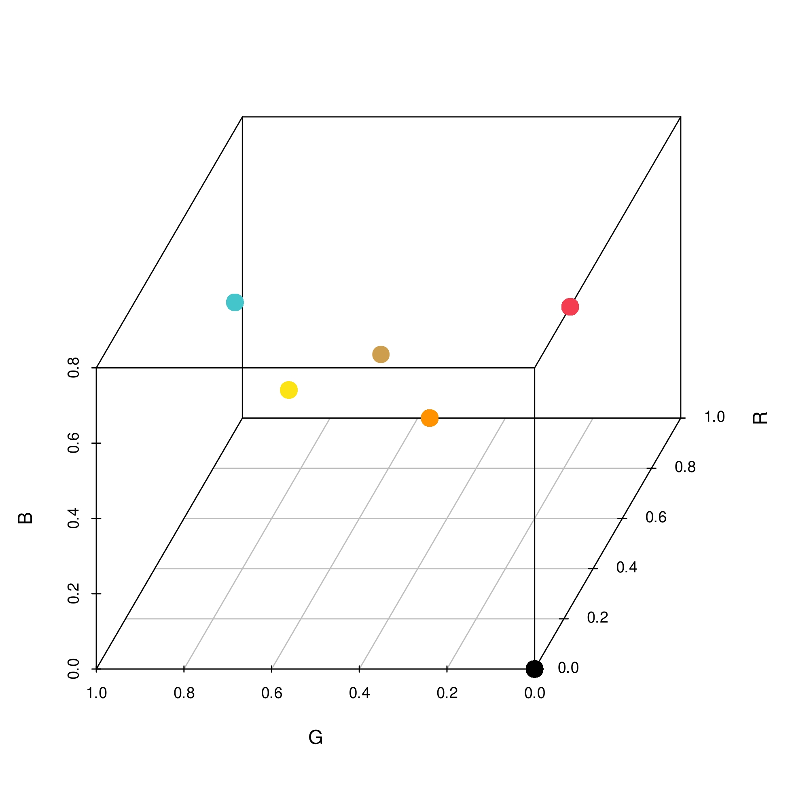
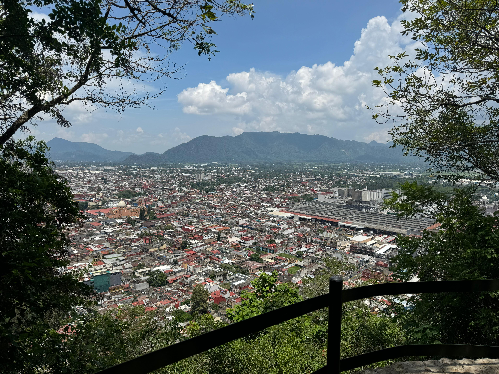

```{r setup, include=FALSE}
knitr::opts_chunk$set(echo = TRUE,
                      eval = T,
                      message = F,
                      warning = F)
```

\newpage

# Instrucciones

Dada una imagen, descomponerla en sus valores RGB:

-   Calcular el vector de medias.
-   Gráficar en 3D con sus respectivos colores de RGB para cada pixel.
-   Calcula la matriz de varianzas y covarianzas.
-   Calcular la matriz de correlaciones.
-   Dar una interpretación a los resultados obtenidos.

\newpage

# Definiciones necesarias antes de comenzar

# Vector de medias:

El vector de medias para una matriz sera definido como un vector fila de tamaño 1XP donde P es la cantidad de columnas que tenga la matriz de la que se quiere obtener.

$$\bar{x} = [\bar{x}_1 + \bar{x}_2 + \dots+ \bar{x}_p{}] $$

## Matriz de Varianzas y Covarianzas

La forma de calcular la matriz de varianzas y covarianzas de la matriz de datos, puede resumirse en la siguiente expresión:

$$\Sigma = \frac{1}{n-1}  (X^TX-n\bar{x}^T\bar{x})$$

Donde:

$$
\begin{matrix}
\Sigma = \text{Matriz de varianzas y covarianzas} \\
X = \text{Matriz de datos} \\
X^T = \text{Matriz de datos transpuesta} \\
n = \text{Filas o casos de la matriz}\\
\bar{x} = \text{Vector fila de las medias}\\
\bar{x}^T = \text{Vector fila de las medias transpuesto}
\end{matrix}
$$

## Obtención de la matriz de correlaciones

Para obtener la matriz de correlaciones a partir de la matriz de vairanzas y covarianzas, se puede usar la siguiente expresión:

$$R = D^{-1/2}\Sigma D^{-1/2}$$

Donde:

$$
\begin{matrix}
\Sigma = \text{Matriz de varianzas y covarianzas} \\
D = diag(\Sigma) \text{ Es la matriz con la diagonal de la matriz } \Sigma \text{ y 0 en el resto.} 
\end{matrix}
$$

\newpage

# Descomposición de la primer imagen

A continuación se decidió tomar una imagen relativamente simple, puesto que se encuentra conformada por 4 colores sin mayor pretención, aunque realmente son 5 porque toma en cuenta el color negro de los marcos.

Dicha imagen se puede apreciar a continuación:


A continuación se realizo el proceso de descomposición de la misma en sus canales de color primarios RGB con ayuda del lenguaje R :

```{r}
rm(list=ls()) # Para borrar todo lo anterior
## Cargar librerias necesarias ##
library(png) # Libreria para leer PNG's
library(flextable)# LIbreria para hacer tablas bonitas
library(scatterplot3d) #gráficar en 3D
library(rsvg) # Manipular archivos SVG
library(jpeg) # Comprimir el SVG a JPEG

### Cargando la imagen desde la ruta local
ruta = "imagenes/im1.png" # Ruta local de la imagen
imagen = readPNG(ruta) # Descomponer la imagen en sus canales RGB 
str(imagen) # EL archivo cargado es un CUBO de información
```

Al cargar la imagen, descomponerla y preguntarle al software sobre las dimensiones del arreglo que obtuvo, revela que esta imagen es de 328 X 798 pixeles y que están distribuidos en 4 capas de colores: Rojo (R), Verde (G) y Azul (B) pero ademas tiene una cuarta capa que se asume esta asociada con el parámetro $\alpha$ que le dice a los pixeles que tan opacos deben verse.

Siguiendo con la descomposición, se re-ordenan las 3 capas de información en 3 vectores distintos, donde cada vector contendrá la información de todos los pixeles para cada canal de color. Posteriormente los vectores fueron concentrados en una matriz tipo dataframe que contendrá la información de los canales de colores de los pixeles de la imagen. 

```{r }
# Del cubo de información se extrae cada capa de color
rojo = imagen[ , ,1] # Extraer inf de  R
verde = imagen[ , ,2] # Extraer inf de G
azul = imagen[ , ,3] # Extraer inf de B

# Convertir a vectores los canales de color
vrojo = as.vector(rojo) # Vector de rojo
vverde = as.vector(verde) # Vector de verde
vazul = as.vector(azul) # Vector de azul

# Compactar los vectores en un dataframe
datos = cbind.data.frame(R = vrojo,
                         G = vverde,
                         B = vazul)
dim(datos) #EL dataframe esta compuesto por 261744 filas (pixeles) y 3 columnas (R,G y B)
```

A continuación se muestran los primeros 6 casos del dataframe correspondiente a esta imagen conformada por 261,777 pixeles y 3 canales de color:

```{r}
# Mostrar los primeros 6 casos
autofit(theme_box(flextable(head(datos))))
```

Se observa que los valores para cada canal se encuentran entre 0 y 1, esto es porque para el lenguaje R le es más cómodo tomarlos así puesto que simplifica los cálculos internos así como la normalización de los datos, pero si se multiplicaran los valores por 255 podría obtenerse su valor en dicha representación.

## Vector de medias

A continuación se calcula el vector de medias para los canales RGB de la imagen :

```{r}
# Calcular la media de cada variable y hacerla vector
media = data.frame(t(apply(datos,2,mean)))
autofit(theme_box(flextable(media)))
```

$$\vec{\mu} = [0.802177,0.6180255,0.3007519]$$

\newpage

## Representación en 3D

Posteriormente, el vector se añade a los datos para mostrar la representación de sus pixeles en un espacio de 3 dimensiones de la siguiente forma:

```{r, eval = F}
# Añadir el vector de medias a los datos
datos1 = rbind.data.frame(datos,media)
# Realizar el gráfico en 3D
scatterplot3d(datos1[,1:3], # Datos de R,G y B como X,Y y Z 
              color = rgb(datos1$R,datos1$G,datos1$B),# Colores acorde a su RGB
              pch = 16, # Forma rellenita de los puntos
              angle = 600, #Rotación del gráfico
              cex.symbols = 2) 
# Exportarlo
```



## Obtención de la matriz de varianzas y covarianzas

A continuación se pone en practica la formula definida al inicio para calcular la matriz de varianzas y covarianzas paso a paso:

```{r}
### Calcular la matriz de varianzas y covarianzas a mano
X = as.matrix(datos) # Matriz de datos X
m = t(apply(datos,2,mean)) # Vector de medias 
n = nrow(X) # Numero de filas
XTX = t(X)%*%X  #Matrix transpuesta por la Matrix no transpuesta
S = (XTX- n*(t(m)%*%m))/(n-1) # Calculo de la matriz de varianzas y covarianzas
# Pasar a una tabla bonita:
autofit(theme_box(flextable(as.data.frame(S))))
```

Convertida a una expresión más formal y bonita, la matriz de varianzas y covarianzas toma la siguiente forma:

$$
\begin{bmatrix}
 0.09732109 & -0.024705326 & -0.090221562 \\
-0.02470533 & 0.061503514 & 0.005918216 \\
-0.09022156 & 0.005918216 & 0.095997109
\end{bmatrix}
$$

## Obtención de la matriz de las correlaciones

Ahora, es el turno de poner en practica el calculo de la matriz de correlaciones definida al inicio del documento, haciendo el calculo tal cual se especifico:


```{r}
# Hacer la matriz diagonal
D = matrix(0,3,3) 
diag(D) = diag(S)
# Usarla en la expresión
R = sqrt(solve(D)) %*% S %*% sqrt(solve(D))
colnames(R) = c("R","G","B")
# Pasar a una tabla bonita:
autofit(theme_box(flextable(as.data.frame(R))))
```

Convertida a una expresión más formal y bonita, la matriz de varianzas y covarianzas toma la siguiente forma:

$$
\begin{bmatrix}
 1 & -0.3193281 & -0.9334215 \\
-0.3193281 & 1 & 0.07702146 \\
-0.9334215 & 0.07702146 & 1
\end{bmatrix}
$$

\newpage

# Descomposición de la segunda imagen

Una vez que se logro descomponer la primer imagen que resultaba ser simple debido a que no estaba compuesta por demasiados colores distintos, es que se opto por intentar procesar una imagen más compleja como es la siguiente:


Notese que el formato es distinto, hubo un cambio de **.png** a **.jpg**, ademas que la complejidad de colores y tamaño es superior a la primer imagen.

A continuación se realizo el proceso de descomposición de la misma en sus canales de color primarios RGB con ayuda del lenguaje R :

```{r}
rm(list=ls()) # Para borrar todo lo anterior
#### Cargar y descomponer la imagen 2. ####
ruta = "imagenes/im2.jpg"
imagen = readJPEG(ruta) # Leer jpg y jpeg
str(imagen) # EL archivo cargado es un CUBO de información
```

Al cargar la imagen, descomponerla y preguntarle al software sobre las dimensiones del arreglo que obtuvo, revela que esta imagen es de 1125 X 2000 pixeles y que están distribuidos en 3 capas o canales de colores (RGB).

Se convierte a vector cada canal de color y posteriormente se unen todos en un solo dataframe como sigue:

```{r }
## Del cubo de información se extrae cada capa de color##
rojo = imagen[ , ,1] # Extraer inf de  R
verde = imagen[ , ,2] # Extraer inf de G
azul = imagen[ , ,3] # Extraer inf de B
# Compactar los vectores en un dataframe
datos = cbind.data.frame(R = as.vector(rojo),
                         G = as.vector(verde),
                         B = as.vector(azul))
dim(datos)
```

A continuación se muestran los primeros 6 casos del dataframe correspondiente a esta imagen conformada por 2,250,000 pixeles y 3 canales de color:

```{r}
# Mostrar los primeros 6 casos
autofit(theme_box(flextable(head(datos))))
```

Se observa como los valores van de 0 a 1 y que ademas ninguno de los primeros 6 casos presenta valores iguales.

## Vector de medias

A continuación se calcula el vector de medias para los canales RGB de la imagen :

```{r}
# Calcular la media de cada variable y hacerla vector
media = data.frame(t(apply(datos,2,mean)))
autofit(theme_box(flextable(media)))
```

$$\vec{\mu} = [0.5490359,0.3175901,0.4056141]$$

El vector de medias al ser convertido a valor hexadecimal, proyecta un color morado claro.

\newpage

## Representación en 3D

Posteriormente, el vector se añade a los datos para mostrar la representación de sus pixeles en un espacio de 3 dimensiones.

```{r, eval = F}
# Añadir el vector de medias a los datos
datos1 = rbind.data.frame(datos,media)
# Realizar el gráfico en 3D
# Hacer el gráfico con RGL
plot3d(datos$R,datos$G,datos$B,
       xlab = "Rojo",ylab ="Verde", zlab = "Azul",
       size = 5,
       col = rgb(datos$R,
                 datos$G,
                 datos$B))
```


Lo primero que salta a la vista es la gran cantidad de puntos que se proyectan en el espacio, por lo que en un inicio, el punto que representa al vector de medias se pierde entre la multitud.

Un aspecto que resalta en el gráfico es la segmentación sel color azul, puesto que esta presente en la imagen pero no demasiados degradados del mismo, puesto que se observa que hay una separación muy marcada entre los puntos azules y el resto.

## Obtención de la matriz de varianzas y covarianzas

Debido a que ya se probo la formula de la matriz de varianzas y covarianzas paso a paso, se toma la decisión de obtenerla mediante una formula sintetizada de la siguiente manera:

```{r}
### Calcular la matriz de varianzas y covarianzas 
S = var(datos) # Funcion para calcular la var y cov
autofit(theme_box(flextable(as.data.frame(S))))
```

Convertida a una expresión más formal y bonita, la matriz de varianzas y covarianzas toma la siguiente forma:

$$
\begin{bmatrix}
 0.09264160 & 0.05427319 & 0.04362137 \\
0.05427319 & 0.05769470 & 0.04857849 \\
0.04362137 & 0.04857849 & 0.05944955
\end{bmatrix}
$$

## Obtención de la matriz de las correlaciones

Ahora, es el turno de poner en practica el calculo de la matriz de correlaciones definida al inicio del documento, haciendo el calculo tal cual se especifico:


```{r}
# Obtener la matriz de correlaciones
R = cor(datos) # Matriz de correlaciones
autofit(theme_box(flextable(as.data.frame(R))))
```

Convertida a una expresión más formal y bonita, la matriz de varianzas y covarianzas toma la siguiente forma:

$$
\begin{bmatrix}
 1 & 0.7423596 & 0.5877897 \\
0.7423596 & 1 & 0.8294721 \\
0.5877897 & 0.8294721 & 1
\end{bmatrix}
$$

\newpage

# Descomposición de la tercer imagen

Una vez probado que el software pudo manejar la imagen anterior, se propone la descomposición de una imagen 4k de un paisaje para llevar al limite el programa.

Dicha imagen se puede apreciar a continuación:



A continuación se realizo el proceso de descomposición de la misma en sus canales de color primarios RGB con ayuda del lenguaje R :

```{r}
#### Cargar y descomponer la imagen 3. ####
rm(list=ls())
ruta = "imagenes/im3.jpeg"
imagen = readJPEG(ruta)
str(imagen) # EL archivo cargado es un CUBO de información
```

Al cargar la imagen, descomponerla y preguntarle al software sobre las dimensiones del arreglo que obtuvo, revela que esta imagen es de 3120 X 4160 pixeles y que están distribuidos en 3 capas de colores: Rojo (R), Verde (G) y Azul (B).

A continuación se descompone unen los vectores de las 3 capas para formar un solo dataframe con los datos de los pixeles:

```{r }
## Del cubo de información se extrae cada capa de color##
rojo = imagen[ , ,1] # Extraer inf de  R
verde = imagen[ , ,2] # Extraer inf de G
azul = imagen[ , ,3] # Extraer inf de B

# Compactar los vectores en un dataframe
datos = cbind.data.frame(R = as.vector(rojo),
                         G = as.vector(verde),
                         B = as.vector(azul))
dim(datos) # Verificar dimensiones
```

A continuación se muestran los primeros 6 casos del dataframe correspondiente a esta imagen conformada por 12,979,200 pixeles y 3 canales de color:

```{r}
# Mostrar los primeros 6 casos
autofit(theme_box(flextable(head(datos))))
```

Se observa que todos los casos tienen valores diferentes, no hay repetidos.

## Vector de medias

A continuación se calcula el vector de medias para los canales RGB de la imagen :

```{r}
# Calcular la media de cada variable y hacerla vector
media = data.frame(t(apply(datos,2,mean)))
autofit(theme_box(flextable(media)))
```

$$\vec{\mu} = [0.3516776,0.3926624,0.3915021]$$

\newpage

## Representación en 3D

Posteriormente, el vector se añade a los datos para mostrar la representación de sus pixeles en un espacio de 3 dimensiones de la siguiente forma:

```{r, eval = F}
# Añadir el vector de medias a los datos
datos1 = rbind.data.frame(datos,media)
# Realizar el gráfico en 3D
# Hacer el gráfico con RGL
plot3d(datos$R,datos$G,datos$B,
       xlab = "Rojo",ylab ="Verde", zlab = "Azul",
       size = 5,
       col = rgb(datos$R,
                 datos$G,
                 datos$B))
```


## Obtención de la matriz de varianzas y covarianzas

A continuación se obtiene la matriz de forma directa con ayuda de la formula:

```{r}
### Calcular la matriz de varianzas y covarianzas a mano
S = var(datos)
# Pasar a una tabla bonita:
autofit(theme_box(flextable(as.data.frame(S))))
```

Convertida a una expresión más formal y bonita, la matriz de varianzas y covarianzas toma la siguiente forma:

$$
\begin{bmatrix}
0.06478517 & 0.06580466 & 0.07185973 \\
0.06580466 & 0.07052378 & 0.07957987 \\
0.07185973 & 0.07957987 & 0.09660439
\end{bmatrix}
$$

## Obtención de la matriz de las correlaciones

A continuación se obtiene la matriz de correlaciones con ayuda de la formula directa:

```{r}
# Hacer la matriz diagonal
R = cor(datos)
# Pasar a una tabla bonita:
autofit(theme_box(flextable(as.data.frame(R))))
```

Convertida a una expresión más formal y bonita, la matriz de varianzas y covarianzas toma la siguiente forma:

$$
\begin{bmatrix}
1.000000 & 0.9735340 & 0.9083420 \\
0.973534 & 1.0000000 & 0.9641332 \\
0.908342 & 0.9641332 & 1.0000000
\end{bmatrix}
$$

\newpage


# Resumen

\begin{table}[h!]
\centering
\begin{tabular}{ccc}
% Primera fila de imágenes
\includegraphics[width=0.3\textwidth]{imagenes/im1.png} &
\includegraphics[width=0.3\textwidth]{imagenes/im2.jpg} &
\includegraphics[width=0.3\textwidth]{imagenes/im3.jpeg} \\
\textbf{Imagen 1} & \textbf{Imagen 2} & \textbf{Imagen 3} \\

% Segunda fila de imágenes
\includegraphics[width=0.3\textwidth]{imagenes/C1.png} &
\includegraphics[width=0.3\textwidth]{imagenes/C2.png} &
\includegraphics[width=0.3\textwidth]{imagenes/C3.png} \\
\textbf{Medias 1} & \textbf{Medias 2} & \textbf{Medias 3} \\
% Tercera fila de imágenes
\includegraphics[width=0.3\textwidth]{imagenes/R1.jpg} &
\includegraphics[width=0.3\textwidth]{imagenes/R2.jpg} &
\includegraphics[width=0.3\textwidth]{imagenes/R3.jpg} \\
\textbf{Dispersión 1} & \textbf{Dispersión 2} & \textbf{Dispersión 3} \\

\end{tabular}
\caption{Tabla con el resumen de las imagenes}
\end{table}

Se observa como para la primer imagen, el vector promedio de colores termina siendo un color entre amarillo y cafe, en donde su representación en tres dimensiones resulta simple, con apenas 6 puntos en el espacio que representan los colores que componen a la imagen junto con el vector promedio.

Sobre la matriz de varianzas y covarianzas, indica que existe una baja variabilidad entre los colores debido a que como son apenas 5 colores diferentes y dichos colores se encuentran en un rango no muy alejados unos de otros, no se refleja tanta variabilidad en los datos.

La matriz de correlaciones muestra que el rojo tiene una correlación negativa alta con el azul, mientras que eñ azul y el verde tienen una correlación mínima casi de 0, esto tiene sentido puesto que la presencia del verde es nula en la primer imagen.


\newpage

# Bibliográfia

*   Richards, J. A. (2008). Remote Sensing Digital Image Analysis: An Introduction. https://ci.nii.ac.jp/ncid/BB12871218
