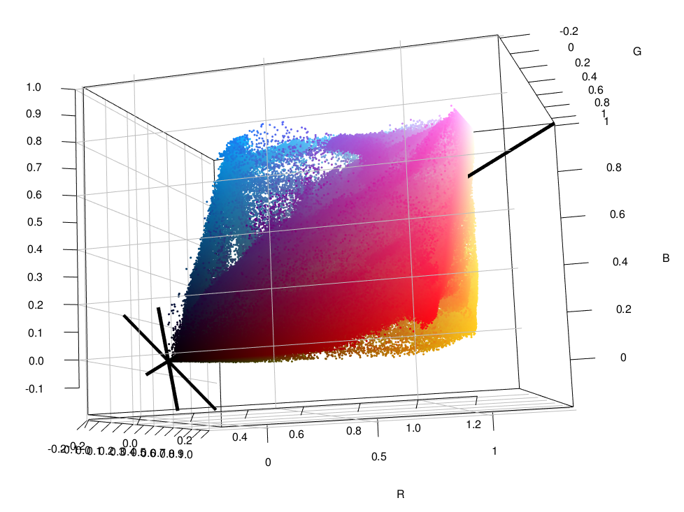
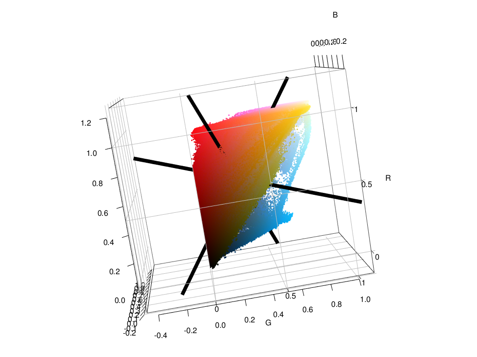
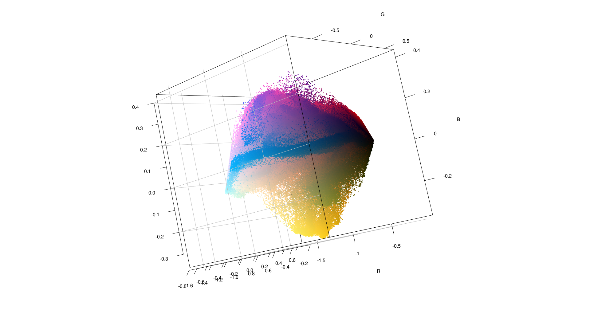
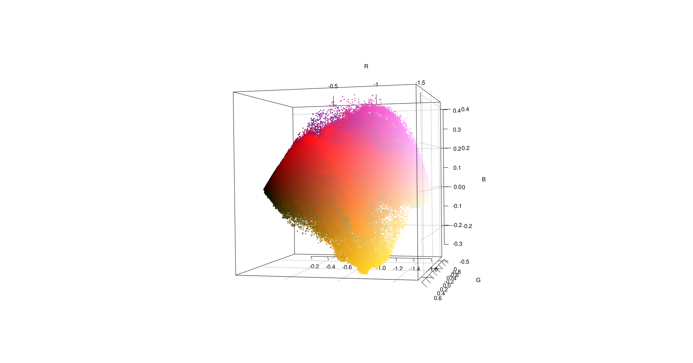

```{r setup, include=FALSE}
knitr::opts_chunk$set(echo = TRUE,
                      eval = T,
                      message = F,
                      warning = F)
```

\newpage

# Instrucciones

Retomando una de las imágenes de la tarea 1:

- Calcular el vector de medias, matriz de varianzas y covarianzas y la matriz de correlaciones.
- Calcular los eigenvalores y los eigenvectores y darles una breve explicación de la varianza explicada.
- Gráficar los nuevos ejes en el espacio original usando el origen como referencia.
- Gráficar los nuevos ejes respecto al vector medio.
- Calcular la media, varianza y la correlación de las componentes principales.


\newpage

# Definiciones necesarias antes de comenzar

## Vector de medias:

El vector de medias para una matriz sera definido como un vector fila de tamaño 1XP donde P es la cantidad de columnas que tenga la matriz de la que se quiere obtener.

$$\bar{x} = [\bar{x}_1 + \bar{x}_2 + \dots+ \bar{x}_p{}] $$

## Matriz de Varianzas y Covarianzas

La forma de calcular la matriz de varianzas y covarianzas de la matriz de datos, puede resumirse en la siguiente expresión:

$$\Sigma = \frac{1}{n-1}  (X^TX-n\bar{x}^T\bar{x})$$

Donde:

$$
\begin{matrix}
\Sigma = \text{Matriz de varianzas y covarianzas} \\
X = \text{Matriz de datos} \\
X^T = \text{Matriz de datos transpuesta} \\
n = \text{Filas o casos de la matriz}\\
\bar{x} = \text{Vector fila de las medias}\\
\bar{x}^T = \text{Vector fila de las medias transpuesto}
\end{matrix}
$$

## Obtención de la matriz de correlaciones

Para obtener la matriz de correlaciones a partir de la matriz de vairanzas y covarianzas, se puede usar la siguiente expresión:

$$R = D^{-1/2}\Sigma D^{-1/2}$$

Donde:

$$
\begin{matrix}
\Sigma = \text{Matriz de varianzas y covarianzas} \\
D = diag(\Sigma) \text{ Es la matriz con la diagonal de la matriz } \Sigma \text{ y 0 en el resto.} 
\end{matrix}
$$

## Obtención de los eigenvalores

Para la obtención de los eigenvalores (valores propios) de la matriz de varianzas o de correlación de los datos, se hace resolviendo el determinante para la siguiente expresión:

$$|\Sigma - \lambda I| = 0$$

$$
\begin{matrix}
\Sigma = \text{Matriz de varianzas y covarianzas} \\
\lambda = \text{Valores propios a obtener (tantos valores como columnas tenga la matriz cuadrada)} \\
I = \text{Matriz identidad}
\end{matrix}
$$

## Obtención de los eigenvectores

Para la obtención de los eigenvectores, se debe volver a la expresión anterior y para cada uno de los eigenvalores se debe resolver un sistema de ecuaciones tal que así:


$$[\Sigma - \lambda _1I]g1 = 0$$ 
$$[\Sigma - \lambda _2I]g1 = 0$$

El desglose de las ecuaciones tiene forma de un sistema de ecuaciones lineales que tienen una restricción dada por:

$$g_{11}^2 +  g_{21}^2 = 0$$


$$
\begin{matrix}
\Sigma = \text{Matriz de varianzas y covarianzas} \\
\lambda = \text{Valores propios a obtener (tantos valores como columnas tenga la matriz cuadrada)} \\
I = \text{Matriz identidad}\\
g_1 = \text{Vector columna que contiene los elementos } g_{11},g_{21} \\
\end{matrix}
$$

## Proyección de los datos

Una vez obtenida la matriz de eigenvectores, se calculan las proyecciones de los datos originales sobre el nuevo espacio de la siguiente forma:

$$Y = XD$$

Donde:

$$
\begin{matrix}
Y = \text{Matriz de datos proyectados de tamaño nXp} \\
X = \text{Matriz de datos originales de tamaño nXp)} \\
D = \text{Matriz de eigenvectores de tamaño pXp)} 
\end{matrix}
$$


\newpage

# Resumen de la tarea pasada


\begin{table}[h!]
\centering
\begin{tabular}{ccc}
% Primera fila de imágenes
\includegraphics[width=0.3\textwidth]{imagenes/im1.png} &
\includegraphics[width=0.3\textwidth]{imagenes/im2.jpg} &
\includegraphics[width=0.3\textwidth]{imagenes/im3.jpeg} \\
\textbf{Imagen 1} & \textbf{Imagen 2} & \textbf{Imagen 3} \\

% Segunda fila de imágenes
\includegraphics[width=0.3\textwidth]{imagenes/C1.png} &
\includegraphics[width=0.3\textwidth]{imagenes/C2.png} &
\includegraphics[width=0.3\textwidth]{imagenes/C3.png} \\
\textbf{Medias 1} & \textbf{Medias 2} & \textbf{Medias 3} \\
% Tercera fila de imágenes
\includegraphics[width=0.3\textwidth]{imagenes/R1.jpg} &
\includegraphics[width=0.3\textwidth]{imagenes/R2.jpg} &
\includegraphics[width=0.3\textwidth]{imagenes/R3.jpg} \\
\textbf{Dispersión 1} & \textbf{Dispersión 2} & \textbf{Dispersión 3} \\

\end{tabular}
\caption{Tabla con el resumen de las imagenes}
\end{table}

\newpage

# Imagen seleccionada para la descomposición

A continuación se muestra la imagen que fue seleccionada para aplicarle la descomposición en pixeles y posteriormente en componentes principales


A continuación se muestra el código para cargarla en lenguaje R:

```{r}
rm(list=ls())
# Cargar la imagen en R
## Cargar librerias necesarias ##
library(png) # Libreria para leer PNG's
library(flextable)# LIbreria para hacer tablas bonitas
library(scatterplot3d) #gráficar en 3D
library(rsvg) # Manipular archivos SVG
library(jpeg) # Comprimir el SVG a JPEG
library(rgl) # OpenGL pero para los gráficos en 3D
library(corrplot) # Para gráficar las correlaciones
### Cargando la imagen desde la ruta local
ruta = "imagenes/im2.jpg" # Ruta local de la imagen
imagen = readJPEG(ruta) # Descomponer la imagen en sus canales RGB 
str(imagen) # EL archivo cargado es un CUBO de información
```

La imagen esta compuesta por 1125 pixeles de largo, 2000 de ancho y 3 capas de colores que corresponden al RGB (Rojo, verde y azul respectivamente)

Al convertir las capas de colores en vectores para unirlos en una sola matriz de datos (dataframe) para trabajar se obtiene:

```{r}
# Extraer la información de sus componentes
# Del cubo de información se extrae cada capa de color
rojo = imagen[ , ,1] # Extraer inf de  R
verde = imagen[ , ,2] # Extraer inf de G
azul = imagen[ , ,3] # Extraer inf de B

# Comprimir esa info en un dataframe

datos = cbind.data.frame(R = as.vector(rojo),
                         G = as.vector(verde),
                         B = as.vector(azul))
dim(datos)
```

Al concentrar la información, resulta que la imagen esta conformada por 2,250,000 pixeles entre los 3 canales de colores.

\newpage

# Calcular el vector de medias, matriz de varianzas y covarianzas y la matriz de correlaciones.

## Vector de medias

```{r}
# Obtener su vector de medias
medias = apply(datos,2,mean)
# Proyectarlo bonito
autofit(theme_box(flextable(as.data.frame(t(medias)))))
```

Al convertir el valor promedio de los pixeles a hexadecimal, se obtiene que el color promedio seria el color correspondiente a "#8C5167", el cual se puede apreciar a continuación:

```{r, echo=FALSE, out.width="1000%", out.height="20%", fig.align='center'}
knitr::include_graphics("imagenes/C2.PNG")
```


## Matriz de varianzas y covarianzas

Para el calculo de la matriz de varianzas y covarianzas, usando la formula descrita al principio para poder cuantificar la variabilidad entre los canales de colores. El resultado se muestra a continuación:

```{r}
# Obtener la matriz de varianzas y covarianzas
S = var(datos)
Si = as.data.frame(round(S,4)) 
autofit(theme_box(flextable(Si)))
```

\newpage

## Matriz de correlaciones

```{r}
# Obtener la matriz de correlaciones
R = cor(datos)
corrplot(R, method = 'square', addCoef.col = 'black')
```

\newpage

# Calcular los eigenvalores y los eigenvectores y darles una breve explicación de la varianza explicada.

Dentro de R existe una función que permite automatizar el calculo de los eigenvalores y los eigenvectores, por lo que se procede a hacer el calculo con ella para no extender el desarrollo manual de las ecuaciones.

## Eigenvalores (Valores propios)

A continuación se muestras los eigenvalores calculados:

```{r}
# OBTENER LOS EIGENVALORES
# Obtener los eigen valores y los eigen vectores
A = eigen(var(datos))
eigenvalores = round(data.frame(eigenvalores = t(A$values)),4)
names(eigenvalores) = paste0("Eigen",1:3)
autofit(theme_box(flextable(eigenvalores)))
```

Se observa que se cumple la siguiente propiedad:

$$\lambda_1\geq \lambda_2 \geq \lambda_3$$

Sobre la proporción de varianza explicada:

```{r}
# Varianza explicada
autofit(theme_box(flextable(round(eigenvalores/sum(eigenvalores),4))))
```

El primer componente explica el 81.18% de la varianza, mientras que el segundo apenas explica el 15.04% de la varianza explicada, es decir, que se podrian utilizar el primer y el segundo componente para explicar el 96.22% de la variabilidad en los datos en 2 dimensiones en lugar de usar 3.

## Eigenvectores

Al resolver el sistema de ecuaciones, los eigenvectores obtenidos fueron los siguientes:

```{r}
### Eigenvectores
autofit(theme_box(flextable(as.data.frame(round(A$vectors,4)))))
```

Estos eigenvectores serán necesarios para poder proyectar los datos originales en el nuevo sistema de coordenadas convierta la correlación entre los datos en 0.

# Gráficar los nuevos ejes en el espacio original usando el origen como referencia.

A continuación se muestra el gráfico de los datos originales con los nuevos ejes dados por los eigenvectores:

```{r,eval = F}
# Primer nuevo eje
origen = c(0,0,0)
eig1 = A$vectors[,1]
eig2 = -eig1
# Segundo nuevo eje
eig3 = A$vectors[,2]
eig4 = -eig3
# Tercer nuevo eje
eig5 = A$vectors[,3]
eig6 = -eig5
### DIBUJAR EL GRÁFICO CON SUS EJES ###
plot3d(datos,
       col = rgb(datos[,1],datos[,2],datos[,3]))
# Agregar las flechas
segments3d(rbind(origen, 0.1*eig1), col = "black", lwd = 5)
segments3d(rbind(origen, 2*eig2), col = "black", lwd = 5)
segments3d(rbind(origen, 0.3*eig3), col = "black", lwd = 5)
segments3d(rbind(origen, 0.3*eig4), col = "black", lwd = 5)
segments3d(rbind(origen, 0.3*eig5), col = "black", lwd = 5)
segments3d(rbind(origen, 0.3*eig6), col = "black", lwd = 5)
# Añadir los ejes X, Y y Z
axes3d(edges = c("x--", "y--", "z--"), col = "black", nticks = 10, cex = 1)
# Añadir una rejilla en los ejes
grid3d(c("x", "y", "z"))

```




Se observa como es 1 el eje que mayor predomina para explicar la varianza de los datos.

# Gráficar los nuevos ejes respecto al vector medio.

```{r,eval = F}
### DIBUJAR EL GRÁFICO CON SUS EJES en la media ###
#datos1 = datos
plot3d(datos,
       col = rgb(datos[,1],datos[,2],datos[,3]))
# Agregar las flechas
segments3d(rbind(medias + eig1, medias - eig1), col = "black", lwd = 8)
segments3d(rbind(medias + eig3, medias - eig3), col = "black", lwd = 8)
segments3d(rbind(medias + eig5, medias - eig5), col = "black", lwd = 8)
# Añadir los ejes X, Y y Z
axes3d(edges = c("x--", "y--", "z--"), col = "black", nticks = 10, cex = 1)
# Añadir una rejilla en los ejes
grid3d(c("x", "y", "z"))
```


\newpage

# Calcular la media, varianza y la correlación de las componentes principales.

## Calculo de los scores

```{r}
# Calculo de los escores con una multiplicación de matrices
scores <- round(as.matrix(datos) %*% A$vectors,3)
autofit(theme_box(flextable(as.data.frame(head(scores))))) 
```

## Proyección de los scores

```{r,eval = F}
#### PROYECTAR LOS NUEVOS PUNTOS ####
#datos1 = datos
plot3d(SCORES,
       col = rgb(datos[,1],datos[,2],datos[,3]),
       xlab = "R", ylab = "G",zlab = "B")
# Añadir los ejes X, Y y Z
axes3d(edges = c("x--", "y--", "z--"), col = "black", nticks = 10, cex = 1)
# Añadir una rejilla en los ejes
grid3d(c("x", "y", "z"))
rgl.snapshot("imagenes/TR4.png")
```





\newpage

## Vector de medias

```{r}
# Obtener su vector de medias
Smedias = apply(scores,2,mean)
# Proyectarlo bonito
autofit(theme_box(flextable(as.data.frame(t(Smedias)))))
```

## Matriz de varianzas y covarianzas

Para el calculo de la matriz de varianzas y covarianzas, usando la formula descrita al principio para poder cuantificar la variabilidad entre los canales de colores. El resultado se muestra a continuación:

```{r}
# Obtener la matriz de varianzas y covarianzas
SS = var(scores)
SSi = as.data.frame(round(SS,4)) 
autofit(theme_box(flextable(SSi)))
```

## Matriz de correlaciones

```{r}
# Obtener la matriz de correlaciones
SR = round(cor(scores),4)
corrplot(SR, method = 'square', addCoef.col = 'black')
```

\newpage

# Conclusiones

Tras realizar el ejercicio, se observa como el realizar la proyección de los datos con ayuda de los componentes principales permite explicar a los datos en menos dimensiones con una perdida de información mínima (depende el caso y los datos).


\newpage

# Bibliográfia

*   Richards, J. A. (2008). Remote Sensing Digital Image Analysis: An Introduction. https://ci.nii.ac.jp/ncid/BB12871218
